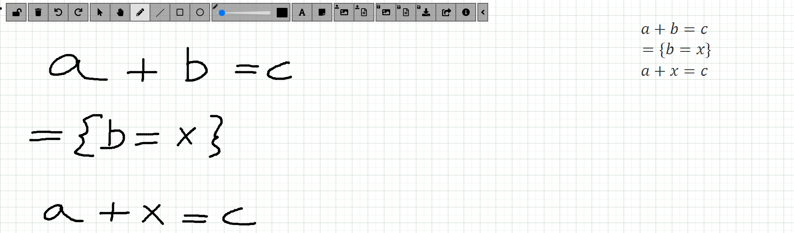

# Online Handwrittten Calculational Mathematics Recognition



This project is consists of the use and extension of an existing online recogniser of handwritten mathematics, [Seshat](https://github.com/nunores/seshat), supporting proofs in the notation used in the Calculational Method. For the frontend, [this whiteboard](https://github.com/nunores/whiteboard) was used as basis. It can be used in a computer or in a tablet PC and it serves as the first step in the development of a software tool that can be applied in educational settings or to validate proofs syntactically and semantically. 

Developed as part of my Master's Thesis in Informatics and and Computing Engineering at Faculdade de Engenharia da Universidade do Porto (FEUP).

## Requirements

[Docker](https://docker.com)

## Installation

#### 1. Clone the repository:

The following instructions all assume the usage of a Linux command bash.
Please adapt accordingly to your operating system.

```bash
git clone https://github.com/nunores/Tablet-PC-Tool-for-Handwriting-Recognition
cd Tablet-PC-Tool-for-Handwriting-Recognition
```

#### 2. Build the docker image

```bash
docker build -t tabletpctool .
```

#### 3. Run docker

```bash
docker run -p 8080:8080 -p 4000:4000 --name tabletpctool tabletpctool
```
##### 4. Terminating or restarting

If you need to terminate or restart the environment, run 

```bash
docker stop tabletpctool
docker start tabletpctool
```
